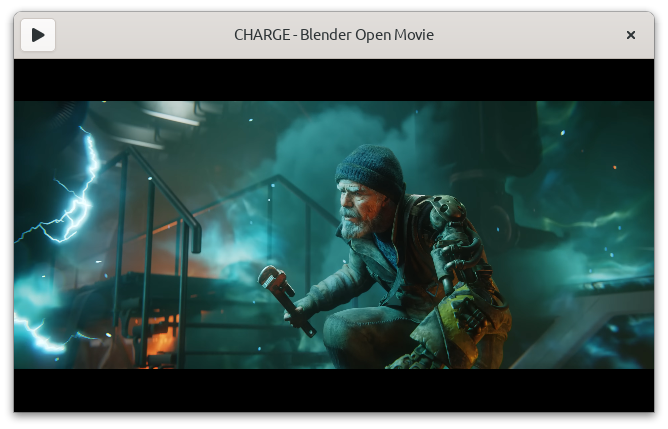

# Nickvision.MPVSharp

 **Use MPV in your C# apps**

MPVSharp provides C# bindings for [libmpv](https://mpv.io/manual/master/#embedding-into-other-programs-libmpv), a library for embedding amazing [MPV](https://mpv.io/) player into another apps.

# Installation
**[MPVSharp](https://www.nuget.org/packages/Nickvision.MPVSharp/)** - main package, requires `libmpv` to be installed on the user system or provided together with your application (works on Windows and Linux).

**[MPVSharp.Bundled](https://www.nuget.org/packages/Nickvision.MPVSharp.Bundled/)** - has `libmpv` built-in (Windows 64-bit only, the build is from [this repo](https://github.com/shinchiro/mpv-winbuild-cmake)).

# How to use

API documentation is available [here](https://nickvision.org/docs/mpvsharp/).

There are 2 namespaces:
* **`Nickvision.MPVSharp.Internal`** provides objects and methods that closely follow libmpv C API. You can find functions from `client.h` in `MPVClient.cs` and functions from `render.h` in `MPVRenderContext.cs`
* **`Nickvision.MPVSharp`** gives you another objects that work on top of `Internal` counterpart, but provides you with various helpers and convenience functions. They are easier to use, but the API is slightly different than in `Internal`, so you will probably want to read docs for [`Client.cs`](https://nickvision.org/docs/mpvsharp/api/Nickvision.MPVSharp.Client.html) to find what methods you can use.

Look at the [examples](#examples) to get the basic idea how to use MPVSharp.

There are comments in the code, but they are mostly an adaptation of some parts of comments from libmpv, which is very well documented:
* [client.h](https://github.com/mpv-player/mpv/blob/release/0.36/libmpv/client.h)
* [render.h](https://github.com/mpv-player/mpv/blob/release/0.36/libmpv/render.h)
* [renger_gl.h](https://github.com/mpv-player/mpv/blob/release/0.36/libmpv/render_gl.h)

Refer to MPV documentation to find the list of [options](https://mpv.io/manual/stable/#options), [commands](https://mpv.io/manual/stable/#list-of-input-commands) and [properties](https://mpv.io/manual/stable/#properties).

# Examples

GirCore example playing [Charge](https://www.youtube.com/watch?v=UXqq0ZvbOnk) - Blender open movie, licensed under CC BY 4.0

* [Simple](Examples/Simple) - basic program playing your file/link. If the file is video, a window will be created by MPV itself.
* [GirCore](Examples/GirCore) - GTK4 application playing a video from youtube. Made with [GirCore](https://github.com/gircore/gir.core). Requires GTK4 to be installed.
* [OpenGL](Examples/OpenGL) - [OpenTK](https://opentk.net/index.html) application playing a video from youtube.
* [SDL](Examples/SDL) - Similar to OpenGL example, but uses [SDL2-CS](https://github.com/flibitijibibo/SDL2-CS/). Requires libSDL2 to be installed.

# Chat

# Dependencies
- [.NET 7](https://dotnet.microsoft.com/en-us/)
- libmpv

# Code of Conduct

This project follows the [GNOME Code of Conduct](https://wiki.gnome.org/Foundation/CodeOfConduct).
